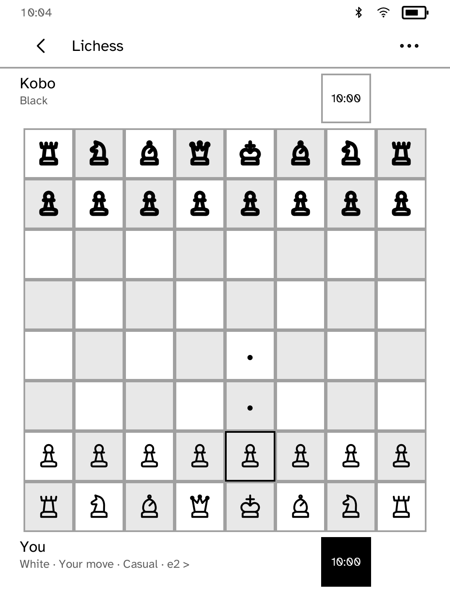
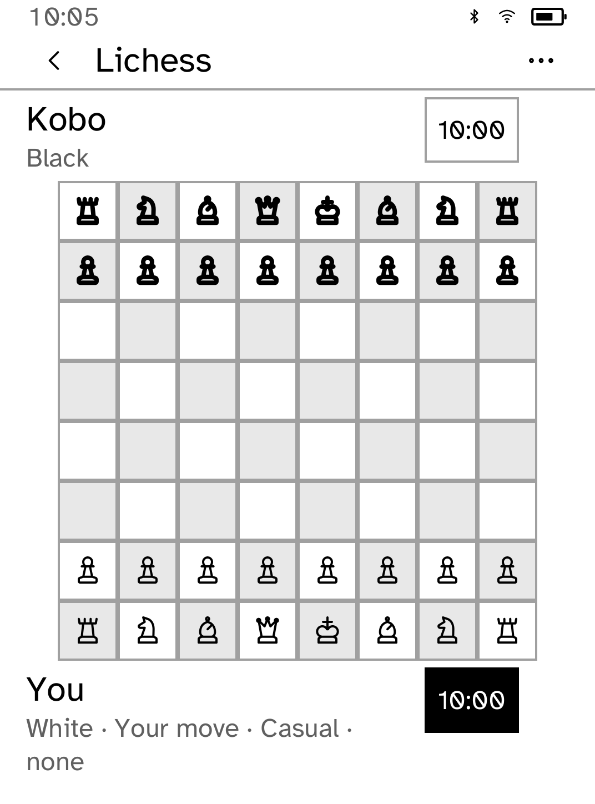
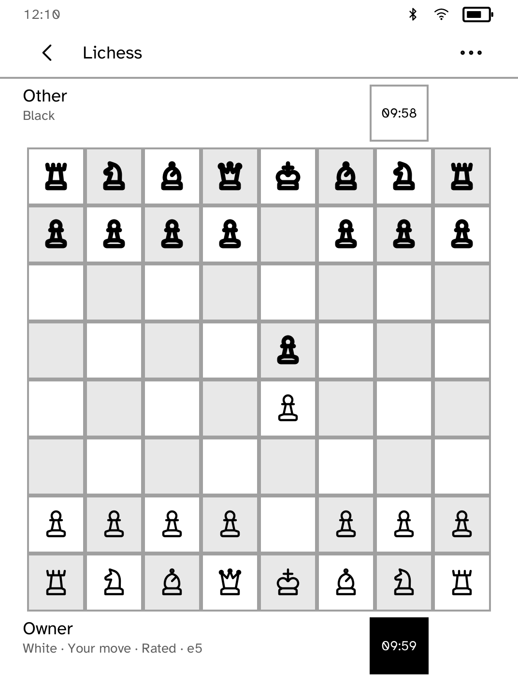
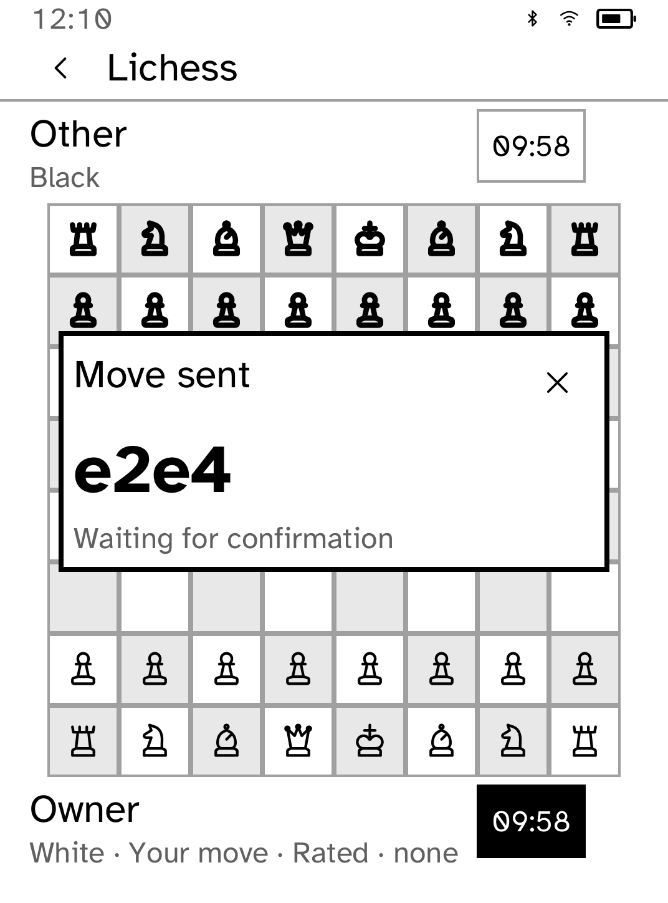
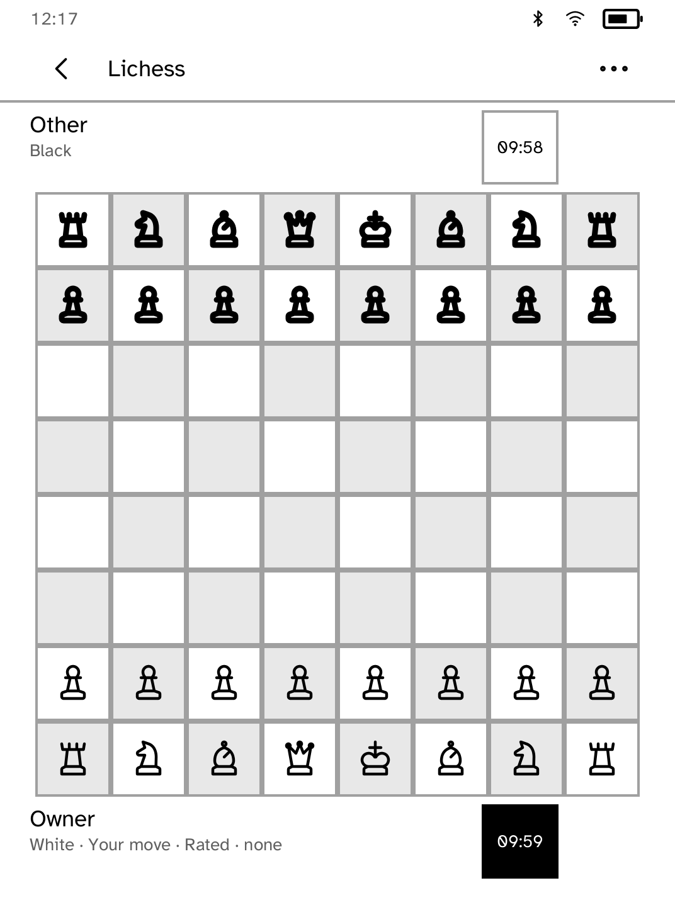
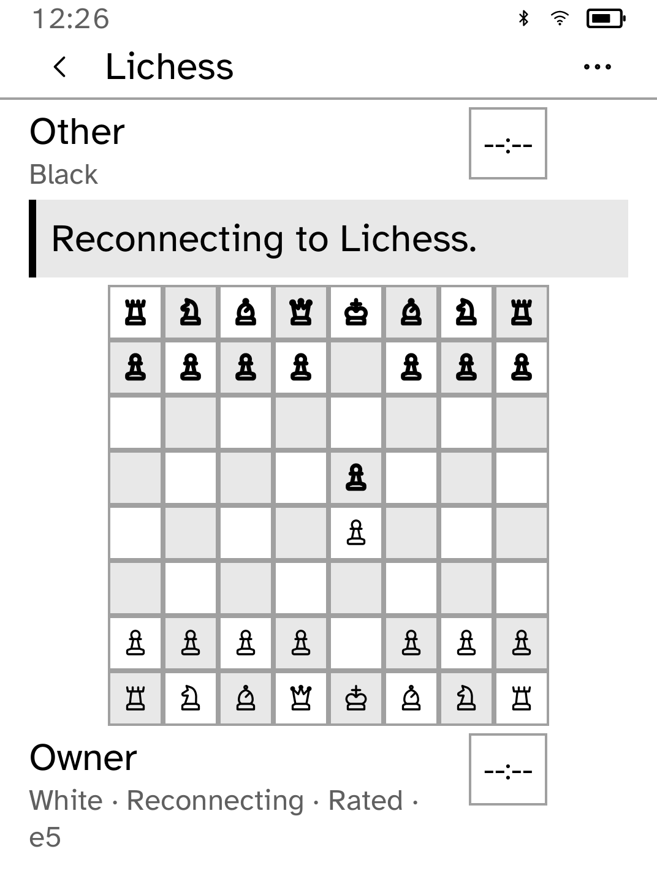
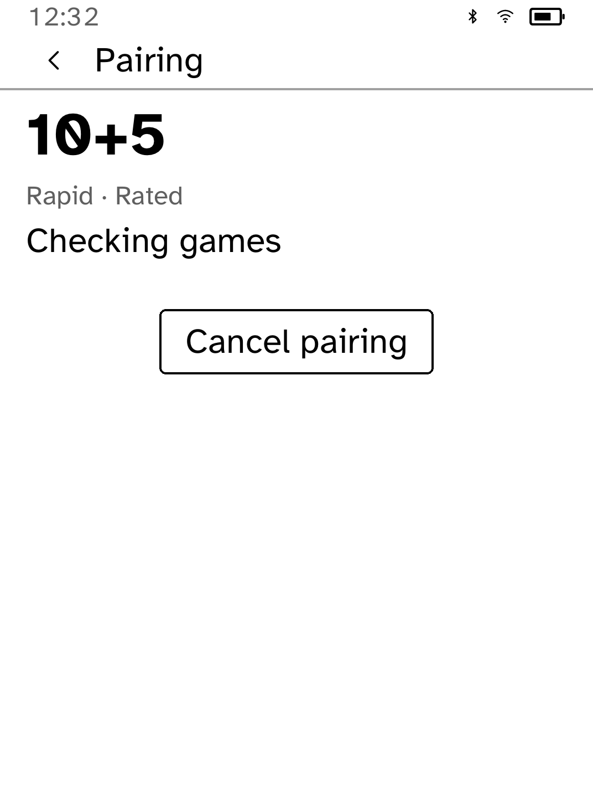
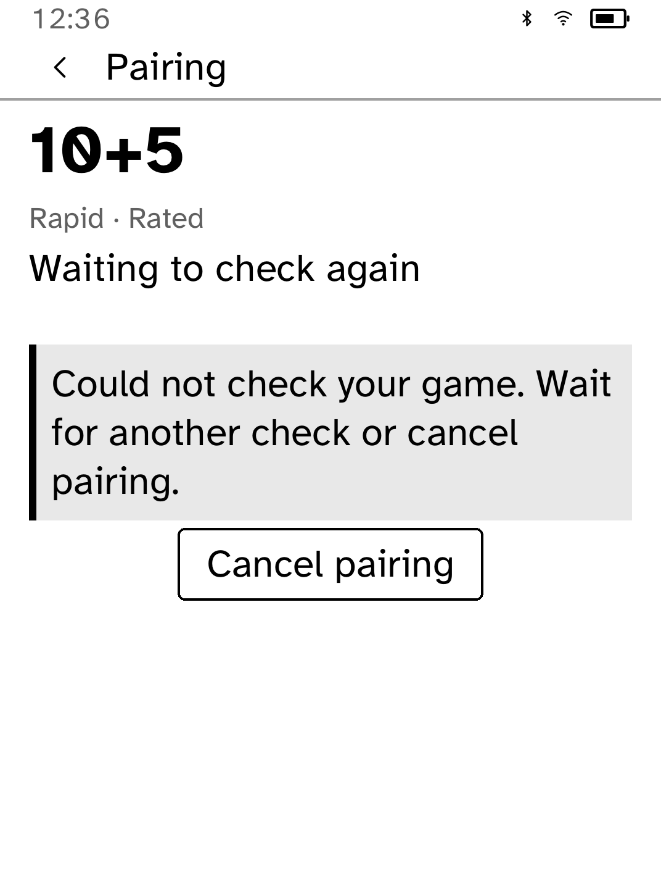

# Lichess

An unofficial, touch-first Lichess Board API client for Cobalt. It supports
responsive Folio time-control presets, incoming standard-clock challenges,
outgoing casual player challenges, live games, and an offline computer game.
Boards use two-tap moves, vector pieces, promotion, dark clocks, draw actions,
resign, and conservative abort.

| Responsive presets | Live board | Pairing |
| --- | --- | --- |
|  |  |  |

## Requirements

- Cobalt **0.3.5 or newer**, speaking protocol **12** for responsive Folio
  card tiles and layout metrics.
- A Lichess Personal Access Token with the `board:play` scope.
- Install the token under the exact secret name `lichess`:

  ```sh
  kobo secret set lichess --from <token-file> --device <address>
  ```

The application sends only the secret name. Cobalt resolves the value inside
the runtime and binds it to the exact HTTPS `lichess.org` Board API routes used
by the app. The token is never returned to the process, shown in UI, written to
state, or included in logs. Redirects carrying the token are denied, and POST
requests are never replayed.

Only the official Lichess origin is supported. This release deliberately does
not accept a custom server URL because Cobalt has no owner-scoped,
app-specific origin policy that could broaden the destination without also
broadening credential authority.

## Supported

- Account validation and live detection of CLI-installed token changes
- Rated random-color 10+0, 10+5, 15+10, 30+0, and 30+20 seeks
- Casual challenges by Lichess username, time control, and side
- Offline play against a bounded safe-Rust engine
- One selected seek at a time, opened only after the event stream and
  current-game snapshot are ready
- A uniquely matching new game opens immediately
- While waiting, check current games every ten seconds to recover a missed start event
- An empty check keeps an open seek waiting; an ended seek is reconciled before reporting no match
- Seeks are never replayed automatically; Cancel stops the recovery checks
- `gameStart`, `gameFinish`, and incoming challenge events
- Board stream reconstruction from server-acknowledged UCI moves
- White/black vector pieces, dark player clocks above and below the board,
  and a portrait board that follows the player's side
- Two-tap source/destination moves with a brief invalid-square mark
- Castling, en passant, and four promotion choices
- Last move, check, result, turn, server clocks, and opponent-gone countdown
- Move, resign, abort during Lichess's first-two-ply window, draw offer/accept/decline, and
  claim-victory requests
- Restart/reconnect using only game ID, color, opponent label, rated flag, and
  a bounded server retry deadline
- Anonymous offline puzzle batches; local solves do not affect Lichess rating

## Deliberate boundaries

- No chat is requested, rendered, or persisted.
- Takeback controls are not offered. A takeback made elsewhere causes an
  authoritative stream reopen instead of guessing at local history.
- Only standard chess clock challenges are accepted.
- Outgoing challenges are casual.
- The offline engine uses deterministic alpha-beta search capped at depth four
  and 5,000 nodes.
- Abort is shown only before both players have moved; Lichess still makes the
  final API decision.
- Draw acceptance and decline remain pending until the authoritative board
  stream reports the resulting state.
- No custom Lichess-compatible base URL is accepted.

## Validate

```sh
cargo test -p kobo-lichess
cargo test -p kobo-net --test lichess_stream_mock -- --test-threads=1
cargo run --locked -p kobo-cli -- app-check --registry apps/catalog.json \
  --package kobo-lichess
```

The HTTPS mock uses a generated test-only CA/key pair under
`crates/kobo-net/tests/fixtures`; it carries no owner credential and never
contacts Lichess.

## Pairing recovery checks

Run `cargo test -p kobo-lichess` for the missed-event, cancellation and
ambiguous-match cases. To check the recovery screen on Clara BW at normal
and 170% text size, build the CLI, then run:

```sh
python3 scripts/quality/check-lichess-pairing-sim.py --output /tmp/lichess-pairing
```

This capture uses an offline demo. It does not create a Lichess game or
validate a live account. The owner-reported delay still needs a live-service
and Clara BW check before LICHESS-06 is closed.


## Offline computer play

Choose **Computer** from the home screen. Tap a piece to see its legal
destinations, then tap a destination to move. The filled clock identifies
whose turn it is. Back returns home; choosing Computer again resumes the
unfinished game. Use the board menu to resign and finish it.

The board uses joined alternating squares and fits alongside both player
rows, including at 170% text size. Long player names stay on one line.




Run the complete offline simulator journey after building the CLI:

```sh
python3 scripts/quality/check-lichess-computer-sim.py --output /tmp/lichess-computer
```

This checks move selection, the computer reply, leaving and resuming the
game, and resignation at normal and 170% text size without credentials.

When a saved online session has no board in memory, **Resume current** opens
the board stream and waits for authoritative moves and clocks. The saved
record contains only the game identity and labels, so a restart does not
invent a board position or replay a move. A confirmed final board result
clears the resumable record.

Online games reserve task capacity for moves: background account polling pauses
while a ready account has a saved game session. Each board request still uses
runtime credential checks. Polling resumes after the game finishes; explicit
account refresh and recovery from missing credentials remain available.

The local TLS acceptance fixture drives the real app through pairing, one move,
a process restart with the same private store, and an agreed draw. It verifies
that POST success alone does not change the displayed position and that restart
restores the acknowledged board. Run from the repository root:

```sh
python3 scripts/quality/check-lichess-session-sim.py --output /tmp/lichess-session
```

Use `--scale 170` for enlarged text. This creates only synthetic local requests;
it uses no live token and does not validate physical Kobo behavior.





If a match starts without its notification reaching the reader, Lichess checks
current games every ten seconds and opens the matching board. Account polling
pauses during pairing so the recovery check has room to run. Cancelling an old
poll frees capacity asynchronously; the check is scheduled when that slot is
released. The original seek is never resubmitted.

Add `--drop-start-event` to the session fixture command to exercise this case.
It asserts recovery without an account recheck or a duplicate seek, then runs
the same move, restart and draw checks.



The filled clock marks the active side. If the board connection drops, the app
keeps the last confirmed position, shows “Reconnecting” and replaces both clock
values with `--:--`. The game continues on Lichess; moves stay unavailable until
a fresh board update restores the position and clocks. Reconnection clears the
old message. Finished games keep their final clock values and show “Finished”
without reconnect or game-action controls.

Use `--disconnect-board` with the session fixture to test the real stream drop,
blocked moves and recovery. It also checks active-side clocks after each move.




Pairing shows the clock setting separately from the game type, including at
enlarged text sizes. “Finding an opponent” changes to “Checking games” while
recovering a possible missed match. Recovery messages explain what is happening
without exposing protocol event names; rate-limit guidance does not claim the
seek was cancelled when only the next check is delayed.



A delayed match check says “Waiting to check again” and keeps cancellation
available. Saved-game and challenge recovery messages explain the next action,
including choosing from Ongoing games when several games match.

The presentation fixture includes the failed-check and cancellation path:

```sh
python3 scripts/quality/check-lichess-pairing-sim.py --scenario pairing-error --output /tmp/lichess-pairing-error
```

This debug demo validates layout and cancellation controls; the separate TLS
session fixture validates transport behavior.


